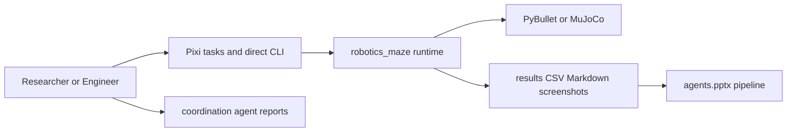
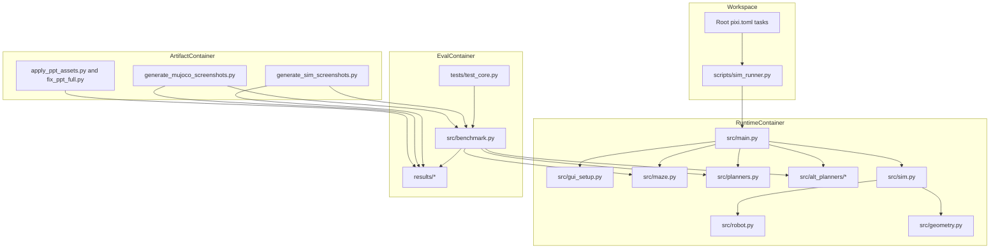
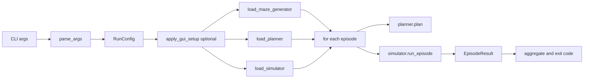

# Architecture Overview

## System Context (C4 Level 1)

The primary actor is a researcher/developer who runs Pixi tasks or direct Python commands. The runtime coordinates planning and simulation, writes benchmark artifacts, and feeds screenshot/deck automation.

## Container Architecture (C4 Level 2)

The repository is organized as task-scoped containers sharing a Python workspace.

## Component Architecture (C4 Level 3)

`main.py` drives the run loop by composing loader strategies and a shared episode contract.

## Architectural Patterns

- `Registry pattern`: planner and heuristic lookup maps in `planners.py` and `heuristics.py`.
- `Adapter pattern`: `FunctionPlannerAdapter` normalizes function planners into the `Planner` protocol.
- `Plugin-by-convention`: loader attempts known module/symbol combinations before stubs.
- `Layered decomposition`: orchestration, domain logic, simulation, and artifact generation are separated by module boundaries.
- `Deterministic execution`: seed offsets and benchmark maze indexing preserve reproducibility.

## Key Design Decisions

1. Runtime supports fallback behavior instead of hard-failing optional integrations.
   - Rationale: preserve execution across environments with different physics/tooling availability.
   - Trade-off: silent fallback can obscure capability differences unless logs are reviewed.

2. Benchmark compares planners on a shared-success subset.
   - Rationale: comparable-time/path metrics remain fair when failures occur.
   - Trade-off: subset metrics can hide behavior on difficult mazes where planners diverge.

3. Planner output is normalized and path-validated before scoring.
   - Rationale: mixed return schemas from baseline/alt planners need a common contract.
   - Trade-off: richer planner-specific metrics are trimmed unless mapped explicitly.

4. Wrapper-based task entry (`scripts/sim_runner.py`) sanitizes passthrough args.
   - Rationale: avoid task-runner separator leakage (`--`) into runtime parsing.
   - Trade-off: root Pixi tasks cover common flows; advanced combinations use direct CLI.

## Module Breakdown

### Runtime Orchestration

- **Purpose**: Parse intent, resolve runtime components, execute episodes.
- **Key modules**: `scripts/sim_runner.py`, `src/main.py`, `src/gui_setup.py`.
- **Notable behavior**: GUI setup override path, URDF validation, per-episode seed derivation.

### Planning and Maze Domain

- **Purpose**: Build deterministic mazes and produce planner paths.
- **Key modules**: `src/maze.py`, `src/planners.py`, `src/alt_planners/`, `src/heuristics.py`.
- **Notable behavior**: baseline planner registry plus alternative planner implementations (`r1`-`r13`).

### Simulation and Robot Control

- **Purpose**: Convert plans to waypoints and run backend-specific episodes.
- **Key modules**: `src/sim.py`, `src/robot.py`, `src/geometry.py`.
- **Notable behavior**: backend preference order and deterministic non-physics fallback.

### Evaluation and Artifacts

- **Purpose**: Benchmark planners and produce consumable output artifacts.
- **Key modules**: `src/benchmark.py`, screenshot scripts, `results/`, deck scripts.
- **Notable behavior**: path validation, ranking policy, Markdown/CSV output contracts.
