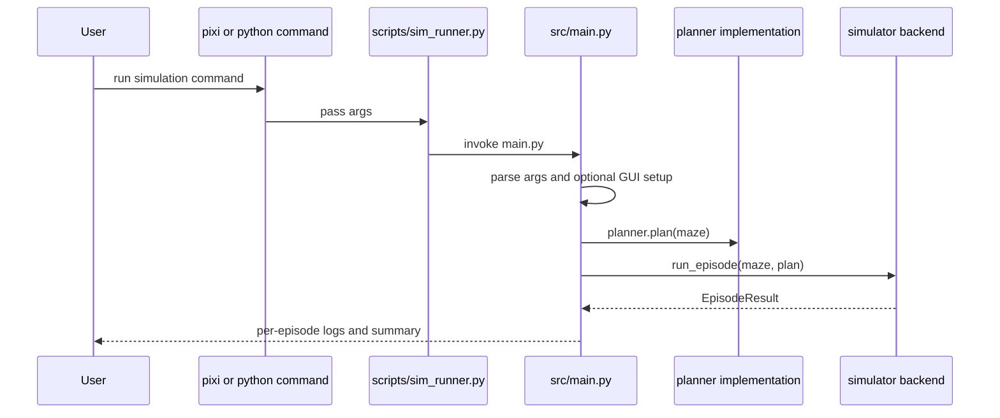
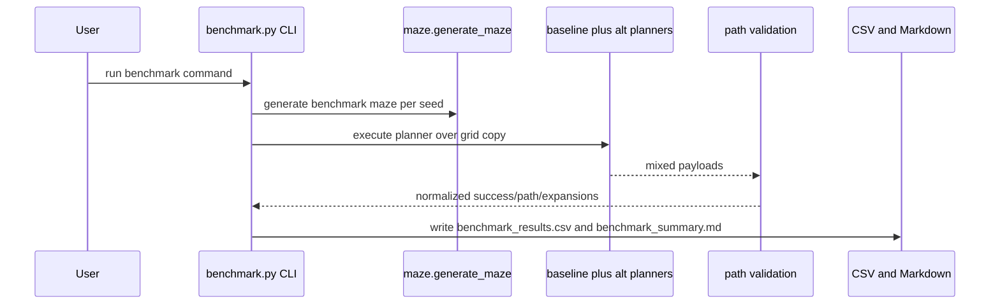
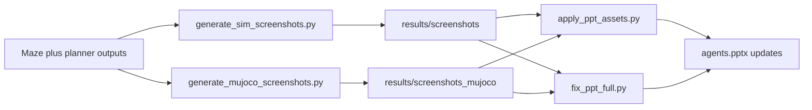
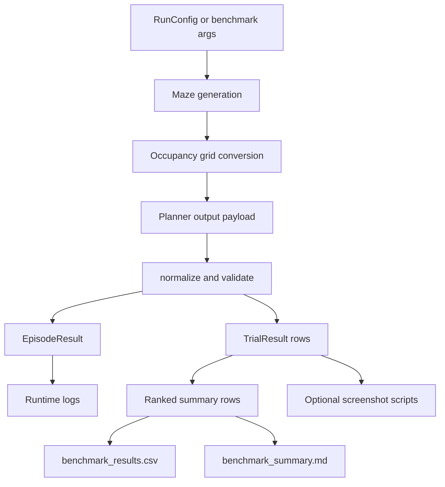

# Workflow Overview

## Core Workflow 1: Simulation Run

The runtime executes one or more episodes using resolved maze, planner, and simulator components.

**Steps**:

1. CLI args are parsed into `RunConfig`.
2. Optional GUI setup can override planner/episodes/maze/backends.
3. Runtime loads maze generator, planner, and simulator via dynamic lookup.
4. Episode loop executes deterministic seeds (`base_seed + episode_index`).
5. Success ratio drives process exit code.

## Core Workflow 2: Benchmark and Ranking

Benchmark mode runs discovered planners on generated mazes, validates paths, and ranks results.

**Steps**:

1. Available planners are loaded (`astar`, `dijkstra`, `greedy_best_first`, plus `r1`-`r9` when enabled).
2. Planner order rotates per maze to reduce first-run cache bias.
3. Path validity is checked for endpoints, bounds, and obstacle crossings.
4. Summary rows are ranked by policy (success rate, comparable time/path, expansions, mean solve time).
5. CSV and Markdown reports are written under `robotics_maze/results/` by default.

## Core Workflow 3: Screenshot and Deck Pipeline

Generated benchmark/simulation data is converted to visual artifacts and injected into presentation assets.

**Steps**:

1. Screenshot scripts render deterministic planner scenes.
2. Images are saved in results folders with metadata-bearing filenames.
3. Deck scripts place and verify assets in `agents.pptx`.

## Data Flow

## State Management

- Runtime flow state is captured in dataclasses (`RunConfig`, `EpisodeResult`, `TrialResult`).
- Planner/heuristic registries are module-level maps keyed by canonical names and aliases.
- Simulation backend state (robot ids, obstacle handles, camera target, waypoints) is encapsulated inside simulator/controller objects.
- Benchmark aggregation groups trial rows per planner and per maze-key to compute comparable metrics.

## Error Handling Strategy

- Missing optional modules resolve to warnings and fallback stubs.
- Invalid URDF input falls back to default URDF after warning.
- Planner exceptions are captured per trial and serialized into `error` in CSV output.
- Invalid planner paths are marked unsuccessful via validation gates instead of crashing full runs.
- Backend selection falls through to the next viable runtime path (`pybullet` -> `mujoco` -> deterministic fallback).
