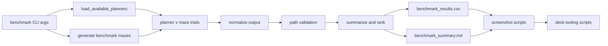

# Deep Dive: Benchmark and Artifact Pipeline

## Overview

This pipeline evaluates planners over deterministic maze sets, validates returned paths, writes ranked reports, and feeds screenshot/deck asset generation workflows.

## Responsibilities

- Discover benchmark planner set and execute planner/maze trials.
- Normalize planner outputs and validate path correctness.
- Persist per-trial CSV and ranked Markdown summaries.
- Provide upstream data for screenshot and deck automation scripts.

## Architecture

## Key Files

- `robotics_maze/src/benchmark.py`: planner discovery, trial execution, normalization, ranking, report writing.
- `robotics_maze/tests/test_core.py`: benchmark/report smoke tests.
- `robotics_maze/results/`: benchmark CSV/Markdown outputs and generated screenshots.
- `robotics_maze/scripts/generate_sim_screenshots.py`: pseudo-3D snapshot renderer.
- `robotics_maze/scripts/generate_mujoco_screenshots.py`: MuJoCo visual snapshot renderer.
- `scripts/apply_ppt_assets.py` and `scripts/fix_ppt_full.py`: presentation asset application.

## Implementation Details

### Planner discovery and execution

- Baseline benchmark planners: `astar`, `dijkstra`, `greedy_best_first`.
- Alt benchmark planners: `r1_weighted_astar` through `r9_bidirectional_bfs`.
- Planner order rotates per maze index to reduce cache/order bias.

### Output normalization and validation

- `_normalize_planner_output` coerces tuple/dict/list returns into `success`, `path`, and `expansions`.
- `_validate_and_measure_path` verifies endpoints, bounds, blocked-cell crossings, and rasterized segment safety.
- Failed normalization/validation marks trial unsuccessful and captures error text when available.

### Ranking and reporting

- `summarize_trials` computes per-planner aggregates and shared-success metrics.
- `rank_summary_rows` orders rows by success rate, comparable time, comparable path length, expansions, then mean solve time.
- `write_results_csv` and `write_summary_markdown` emit stable output contracts used by downstream consumers.

## Dependencies

- **Internal**: `maze.py`, `planners.py`, `alt_planners/*`, `results/`, screenshot scripts.
- **External**: `csv`, `statistics`, `Pillow`, `mujoco`, `python-pptx`.

## Testing

- `test_benchmark_reports_written_to_output_dir` checks report emission and expected output schema fragments.
- End-to-end artifact correctness for screenshots/deck updates is currently validated via script runs.

## Potential Improvements

- Add regression tests for ranking stability and tie-break behavior.
- Emit JSON artifacts alongside CSV/Markdown for machine-to-machine consumers.
- Include backend-aware runtime fields in benchmark outputs for richer cross-analysis.
