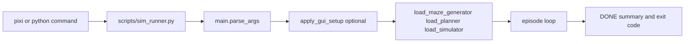

# Deep Dive: Execution Orchestration

## Overview

Execution orchestration connects task entrypoints, runtime argument parsing, optional GUI overrides, dynamic component loading, and per-episode result aggregation.

## Responsibilities

- Normalize command passthrough and invoke the simulation entrypoint.
- Parse CLI arguments into a typed runtime config.
- Optionally collect overrides from Tkinter GUI setup.
- Resolve maze generator, planner, and simulator implementations.
- Run deterministic episode loops and return process-level status.

## Architecture

## Key Files

- `scripts/sim_runner.py`: root wrapper; strips task separators and forwards args.
- `robotics_maze/src/main.py`: parser, loaders, planner adapter, run loop.
- `robotics_maze/src/gui_setup.py`: setup dialog and validation.
- `pixi.toml`: root tasks (`sim`, `benchmark`).

## Implementation Details

### Argument and config model

- `RunConfig` includes planner, episodes, maze size, seed, GUI toggle, backend preference, URDF override, and GUI hold seconds.
- `parse_maze_size` accepts scalar (`N`) or explicit dimensions (`WxH`).

### Loader strategy

- `load_maze_generator` and `load_simulator` iterate known module/symbol candidates.
- `load_planner` supports explicit `<module>:<symbol>`, alt planner module conventions, registry lookup in `planners.py`, and alias fallback maps.
- `FunctionPlannerAdapter` bridges function planners to the runtime planner protocol.

### Episode loop contract

- Seed handling uses `seed + (episode - 1)` for deterministic multi-episode runs.
- Planner output is passed to simulator as-is; simulator is responsible for path extraction/normalization.
- Exit code is `0` only when every episode succeeds.

## Dependencies

- **Internal**: `maze.py`, `planners.py`, `alt_planners/*`, `sim.py`, `gui_setup.py`, `benchmark.py`.
- **External**: `argparse`, `dataclasses`, dynamic imports, optional `tkinter`.

## Testing

- Current automated tests focus on benchmark/reporting contracts (`robotics_maze/tests/test_core.py`).
- CLI/GUI orchestration permutations are primarily smoke-tested via task execution.

## Potential Improvements

- Add dedicated integration tests for argument combinations and GUI override flows.
- Emit structured diagnostics for loader failures (module/symbol resolution trace).
- Add explicit capability reporting for backend availability at startup.
