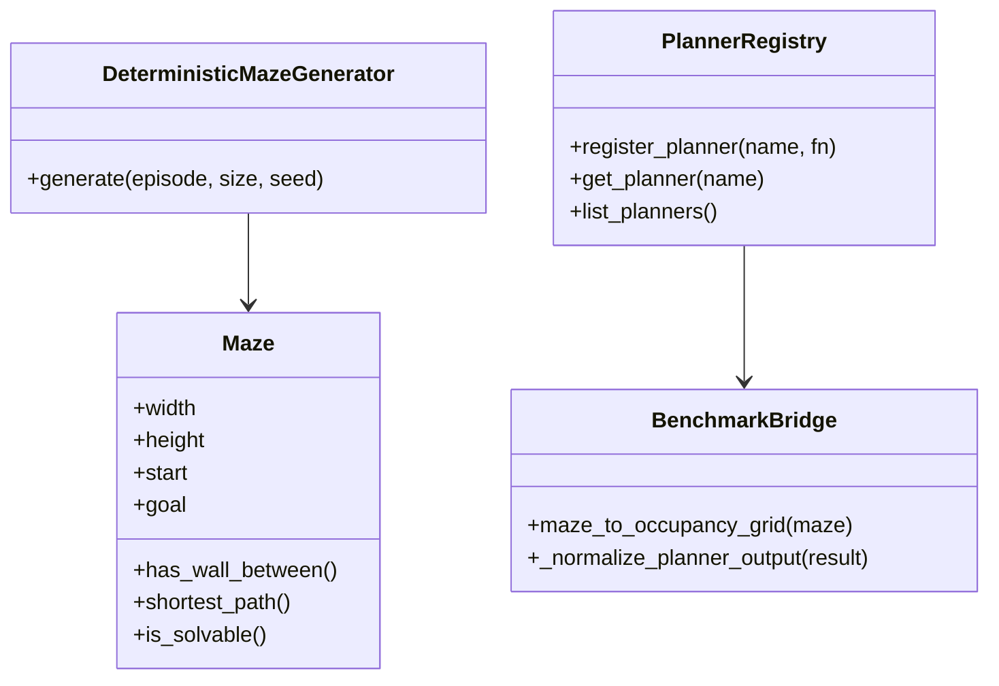

# Deep Dive: Planning and Maze Domain

## Overview

The planning domain combines deterministic maze generation with a registry-driven planner surface and multiple alternative planner modules.

## Responsibilities

- Build valid, solvable mazes from deterministic seeds.
- Convert maze topology into occupancy grids for planner consumption.
- Provide baseline planner APIs and aliases.
- Host alternative planners for algorithm comparisons.

## Architecture

## Key Files

- `robotics_maze/src/maze.py`: maze model, generation algorithms, invariants.
- `robotics_maze/src/planners.py`: baseline planners and alias registry.
- `robotics_maze/src/heuristics.py`: heuristic registration and resolver.
- `robotics_maze/src/alt_planners/`: alternative planner implementations (`r1`-`r13`; `r10` is research markdown).
- `robotics_maze/src/benchmark.py`: occupancy conversion and planner output normalization.

## Implementation Details

### Maze model and generation

- Maze state stores explicit horizontal/vertical wall grids.
- `generate_maze` supports `backtracker` and `prim` algorithms.
- Post-generation checks enforce reachability and start/goal validity.

### Baseline planner registry

- Registered baselines: `astar`, `dijkstra`, `bfs`, `greedy_best_first`.
- Aliases include `greedy`, `gbfs`, `r11_dijkstra`, `r12_bfs`, `r13_gbfs`, and other normalized names.
- Shared search internals (`_best_first_search`) provide consistent metric payloads.

### Alternative planner modules

- Benchmark-discovered alt planners: `r1` through `r9` (explicit module/function spec list).
- Additional runtime-available modules: `r11_dijkstra`, `r12_bfs`, `r13_greedy_best_first`.
- Mixed return formats (dict/tuple/list) are normalized by benchmark/runtime adapter paths.

## Dependencies

- **Internal**: `heuristics.py`, `benchmark.py`, `alt_planners/*`.
- **External**: core logic is mostly standard library, with minimal third-party coupling.

## Testing

- `test_maze_generation_smoke` validates deterministic generation and endpoint consistency.
- `test_astar_solvability_assumption_smoke` verifies repeated solvability on generated mazes.

## Potential Improvements

- Add property tests for maze and path invariants over larger random seed spaces.
- Standardize alt planner metric keys to simplify downstream normalization.
- Expand benchmark discovery to include `r11`/`r12`/`r13` as first-class benchmark options.
