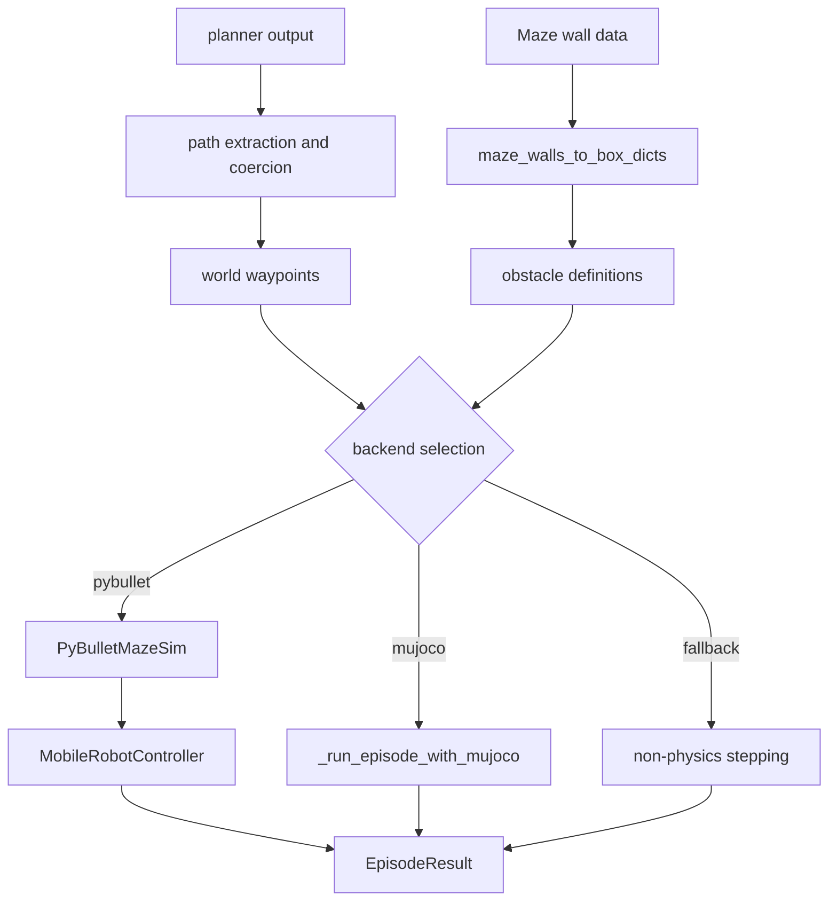

# Deep Dive: Simulation Backends and Robot Control

## Overview

Simulation logic transforms planner paths into world waypoints, builds obstacle geometry from maze walls, and executes episodes via PyBullet, MuJoCo, or deterministic fallback.

## Responsibilities

- Extract and normalize path payloads from heterogeneous planner outputs.
- Convert maze wall topology into obstacle box geometry.
- Execute backend-specific simulation loops and controller updates.
- Return a consistent `EpisodeResult` contract to runtime orchestration.

## Architecture

## Key Files

- `robotics_maze/src/sim.py`: backend selection, path parsing, episode execution.
- `robotics_maze/src/robot.py`: mobile robot path-follow controller.
- `robotics_maze/src/geometry.py`: wall-to-obstacle conversion utilities.

## Implementation Details

### Backend selection

- Supported preferences: `auto`, `pybullet`, `mujoco`.
- Runtime selects available engine based on preference and imports.
- Fallback path maintains deterministic success/step timing when physics engines are unavailable.

### Path normalization

- Path extraction accepts dict/tuple/list payloads and common coordinate encodings.
- Grid-like paths are detected and mapped into world-space coordinates.
- Collinear waypoint compression reduces redundant control updates.

### Controller and obstacle behavior

- PyBullet execution uses `MobileRobotController.step_path_follow()` in step loops.
- MuJoCo path builds temporary XML world models from obstacle boxes.
- Geometry utilities merge wall runs into compact obstacle representations.

## Dependencies

- **Internal**: `robot.py`, `geometry.py`, maze structures from `maze.py`.
- **External**: `pybullet`, `pybullet_data`, `mujoco`.

## Testing

- Automated tests currently emphasize benchmark/report outputs rather than backend internals.
- Backend behavior is validated through smoke runs and screenshot generation workflows.

## Potential Improvements

- Add deterministic backend-specific integration tests with fixed fixtures.
- Emit backend provenance metadata per episode for easier debugging.
- Introduce typed path payload objects to reduce ad-hoc normalization branches.
