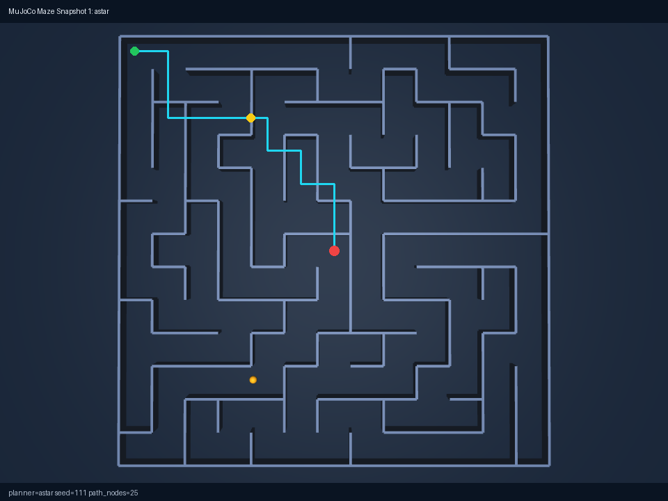
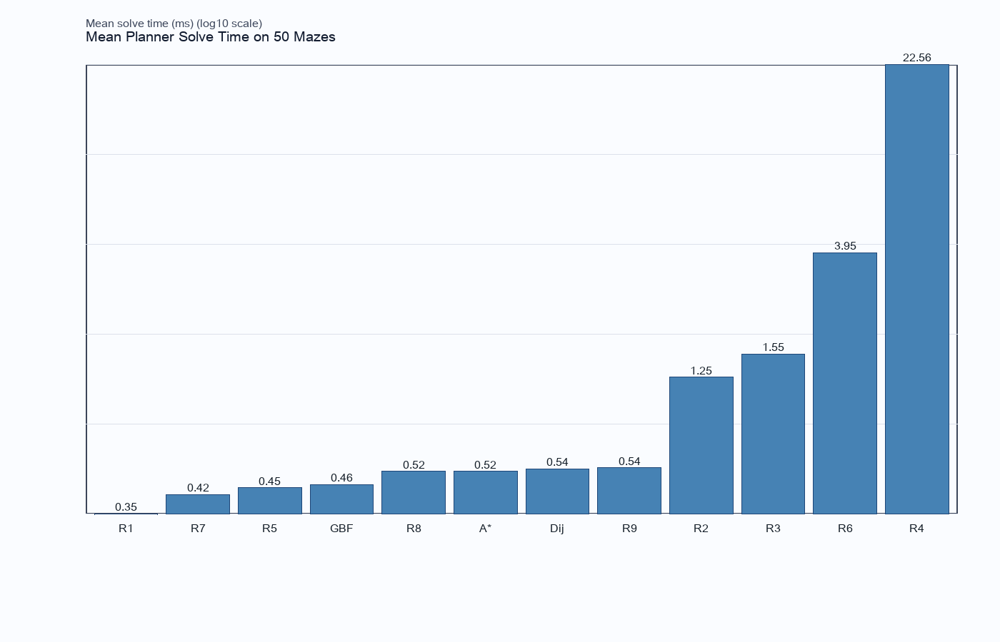

# cosimi-idai-test
## Full Session Prompt -> Step -> Output

This version is a full chat-order reconstruction.

- Canonical full ledger: `docs/generated/session_chat_prompt_ledger.md`
- Paper plan used: `paper/ieee_tro_robotics_maze/coordination/PAPER_WRITING_PLAN_USED.md`

---

# Scope and method

- Source order: full user prompt sequence from this session chat.
- Cross-check source: `robotics_maze/coordination/session_event_log.csv`.
- Output mapping source: repo artifacts, issue IDs, coordination logs.
- Prompt IDs `P01`-`P45` match the full ledger document.

---

# Phase summary A

- Presentation orchestration and content hardening.
- Multi-agent robotics implementation and research fan-out.
- Simulation debug/test loop with screenshot evidence.
- GitHub issue factory for verification tracks.

Primary outputs:

- `agents.pptx`
- `presentation_assets/*`
- `robotics_maze/src/*`
- `robotics_maze/testing/*`

---

# Phase summary B

- GUI and dynamics correction loop.
- High-concurrency agent orchestration and closure tracking.
- IEEE paper orchestration with reviewer-style rounds.
- README/log synchronization and audit pass.

Primary outputs:

- `robotics_maze/coordination/AGENT_DASHBOARD.md`
- `paper/ieee_tro_robotics_maze/coordination/*`
- `robotics_maze/coordination/README_LOG_AUDIT_2026-02-27.md`

---

# Prompt ledger 1/9 (P01-P05)

- P01 `There's a pptx... need 25 slides...` -> Step: deck scope expansion -> Output: `agents.pptx`, `presentation_assets/*`
- P02 `My workflow is codex cli + git skills + Jules/Copilot + Gemini critique...` -> Step: workflow narrative integration -> Output: deck workflow slides
- P03 `In robotics... everything connected can be a tool...` -> Step: toolized-robotics framing -> Output: robotics/deck narrative updates
- P04 `Add a slide... create a skill` -> Step: skill-creation explanation -> Output: deck skill slide
- P05 `add 1 slide for each related skill` -> Step: skill set expansion -> Output: deck + skill references

---

# Prompt ledger 2/9 (P06-P10)

- P06 `i only operate in -yolo mode` -> Step: aggressive execution style applied -> Output: higher-parallel ops pattern
- P07 `explain agent/subagents/max depth/types` -> Step: architecture explanation content -> Output: deck sections on spawning/depth/types
- P08 `GPT 5.2 Pro, planning mode, subscriptions, local models` -> Step: model/tooling comparison content -> Output: deck comparison material
- P09 `difference with 3 main agents... slide on ralph wiggum` -> Step: comparative-behavior slide drafted -> Output: deck content
- P10 `research ralph wiggum technique... wrong` -> Step: correction/research pass -> Output: updated deck wording

---

# Prompt ledger 3/9 (P11-P15)

- P11 `Check every slide... factual + styling + images` -> Step: factual/style audit -> Output: `agents_factual_risk_audit.md`, `presentation_assets/*`
- P12 `spawn as many subagents as possible` -> Step: fan-out orchestration -> Output: coordination activity growth
- P13 repeat of fan-out request -> Step: continued scaling -> Output: expanded agent workstream
- P14 `spawn even more... 3 refs/slide... styling agents` -> Step: references + styling allocation -> Output: `slide_references.json`, layout/style artifacts
- P15 `6 agents robotics build + 10 agents alternatives + supervisor + A* maze` -> Step: B1-B6/R1-R10/S1 structure -> Output: `robotics_maze/src/*`, `research/*`, `coordination/TASK_BOARD.md`

---

# Prompt ledger 4/9 (P16-P20)

- P16 `spawn logger agent writing CSV with timestamps` -> Step: persistent event logging -> Output: `robotics_maze/coordination/session_event_log.csv`
- P17 `assets haven't been added to pptx` -> Step: asset integration correction -> Output: deck/image coverage updates
- P18 `add screenshots of simulation $screenshot` -> Step: screenshot capture + integration -> Output: `robotics_maze/testing/screenshots/*`
- P19 `push test issue... >=10 post-2021 refs` -> Step: create verification issue -> Output: GitHub issue `#1`
- P20 `second issue... pre-2021 refs` -> Step: create second verification issue -> Output: GitHub issue `#2`

---

# Prompt ledger 5/9 (P21-P25)

- P21 `if pybullet doesn't work use mujoco; pixi env` -> Step: fallback backend + env alignment -> Output: sim/backend/pixi updates
- P22 repeat + `please continue` -> Step: continuation of same track -> Output: further backend hardening
- P23 `test, screenshot, analyze, debug + 2 more issues (>=20 refs, 4 sentences)` -> Step: test loop + expanded issues -> Output: `TEST_RUN_LOG.md`, issues `#5` and `#6`
- P24 `spawn Larry monitor; says Icecream [flavor] each poll` -> Step: monitor novelty agent -> Output: Larry events in session log
- P25 `how do I check code works?` -> Step: run command guidance -> Output: chat guidance path

---

# Prompt ledger 6/9 (P26-P30)

- P26 `I want pixi command directly from main folder` -> Step: root-run sim task path -> Output: root `pixi.toml`, `scripts/sim_runner.py`
- P27 `agents improve GUI from root, setup options in GUI` -> Step: GUI setup flow and invocation adjustments -> Output: `robotics_maze/src/gui_setup.py`, GUI docs
- P28 `fix presentation: images/references every slide, aesthetic` -> Step: deck aesthetic/reference pass -> Output: `agents.pptx`, presentation assets updates
- P29 `spawn 3 agents copy skills to /skills; keep in gitignore` -> Step: skill copy + ignore policy -> Output: `/skills/`, `.gitignore`
- P30 `GUI closes, robot not visible, use dynamics and real URDF` -> Step: robot/sim dynamics fixes -> Output: `robotics_maze/src/robot.py`, `robotics_maze/src/sim.py`

---

# Prompt ledger 7/9 (P31-P35)

- P31 `get Jenny to remove Adoption Plan/Closing; check images all slides` -> Step: deck cleanup pass -> Output: deck edits
- P32 `What agents are working currently...` -> Step: active-task visibility and closure checks -> Output: dashboard/status updates
- P33 repeat completion pressure -> Step: continue and avoid interruption -> Output: more closure/integration actions
- P34 `I want 36 agents on 36 distinct tasks...` -> Step: large parallel decomposition across GUI/dynamics/ppt/images/refs/docs -> Output: many coordination logs/reports
- P35 `check all agents fully closed` -> Step: closure verification -> Output: closed-agent confirmations

---

# Prompt ledger 8/9 (P36-P40)

- P36 repeated closure check -> Step: re-verification -> Output: reconfirmed closure state
- P37 `coordinate agents to write IEEE LaTeX paper... >=40 refs >=2021` -> Step: paper orchestration start -> Output: paper coordination/review pipeline
- P38 repeated paper prompt -> Step: requirement reaffirmation -> Output: same plan constraints
- P39 `Implement the plan` -> Step: execute paper plan end-to-end -> Output: review rounds, manuscript revisions, package artifacts
- P40 `Raise around 10 issues to github...` -> Step: create follow-up work items -> Output: issues `#9`-`#18`

---

# Prompt ledger 9/9 (P41-P45)

- P41 `have all local readmes/logs been updated?` -> Step: freshness audit run -> Output: repo-wide doc/log update cycle
- P42 `spawn around 16 agents to review logs/readmes` -> Step: 16-agent synchronization pass -> Output: `README_LOG_AUDIT_2026-02-27.md`, `agent_reports/*`
- P43 `what is this repo about` -> Step: repo summary response -> Output: chat summary
- P44 `add plan used + prompts/steps slideshow` -> Step: initial docs pass -> Output: first plan/slideshow drafts
- P45 `not real plan / not all prompts / investigate fully` -> Step: full reconstruction and rewrite -> Output: this full slideshow + full prompt ledger + corrected paper plan

---

# Key evidence snapshots

Simulation screenshot evidence:

Paper figure evidence:

---

# Where to audit everything

- Full prompt ledger: `docs/generated/session_chat_prompt_ledger.md`
- Paper plan used: `paper/ieee_tro_robotics_maze/coordination/PAPER_WRITING_PLAN_USED.md`
- Session event CSV: `robotics_maze/coordination/session_event_log.csv`
- GitHub backlog mirror: `robotics_maze/coordination/BACKLOG_SUMMARY.md`
- Session changelog: `CHANGELOG_SESSION.md`
